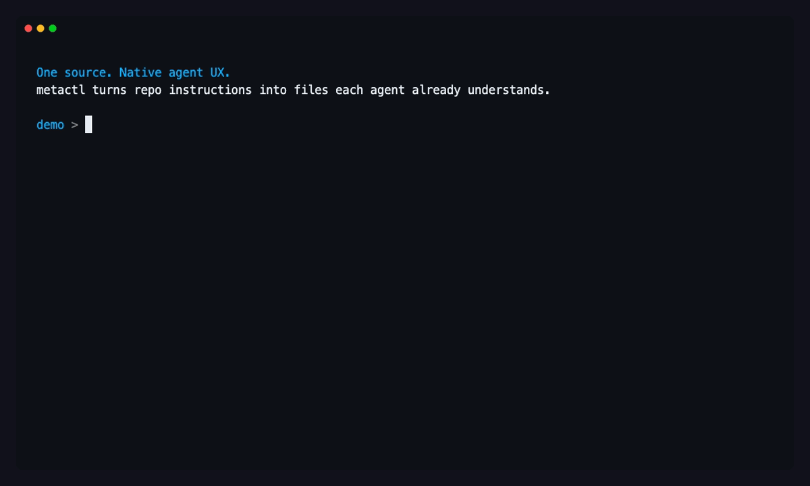
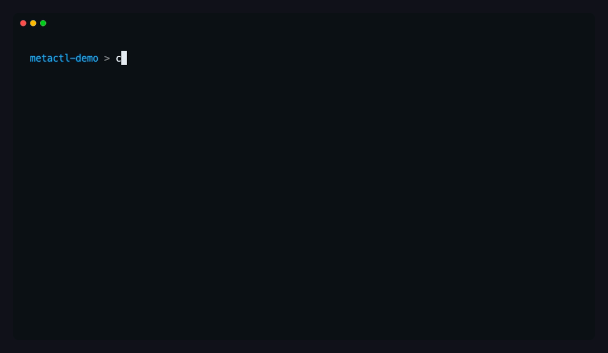
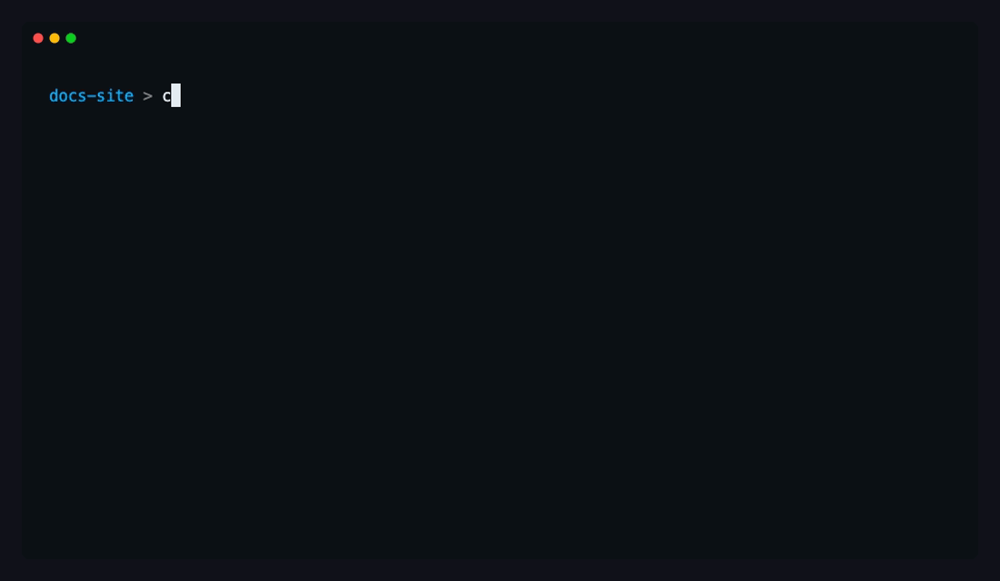
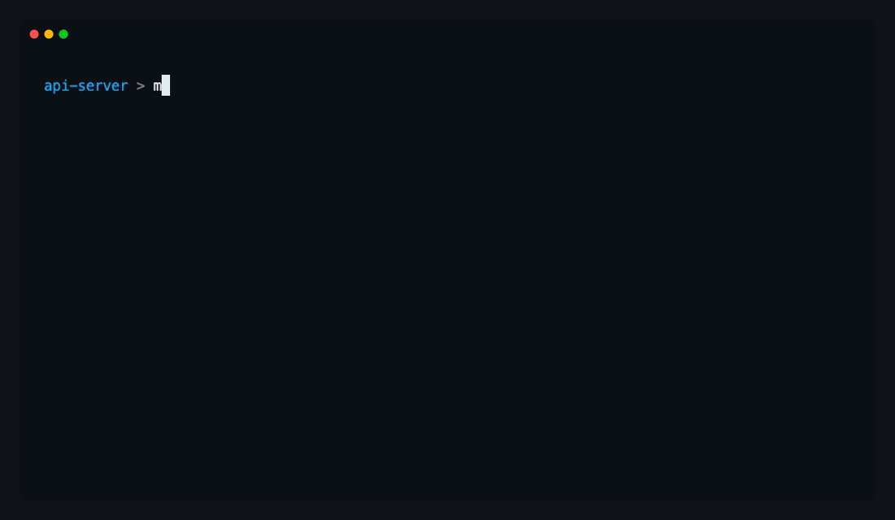

# CLI Demos

These rendered demos are source-controlled public assets for README, docs, and release notes. They use disposable demo workspaces, isolated shell config, GitHub Dark terminal colors, ANSI-emitting JSON/YAML highlighting, humanized typing, and read-time dwell sized to the amount of text on screen.

The marketing GIFs intentionally show relatable workspace names such as `acme/api-server` and `acme-platform`. The built-in `metactl demo` command still uses sentinel-guarded temporary sandboxes by default.

## README hero

Use the quickstart hero when the viewer needs the product thesis in one loop: natural-language search, one-command activation, and explainable projection.

## Asset catalog

| Asset | Best location | Shows |
|---|---|---|
| `quickstart-hero.gif` | README hero, launch posts | Natural-language discovery, `metactl use`, `metactl explain` |
| `search-use-sync.gif` | Getting started docs | Discovery to activation to validation |
| `explain-json.gif` | API/CI docs | Machine-readable explain/validate output with highlighted JSON |
| `fleet-preview.gif` | Fleet docs | Multi-project controller config, fleet status, preview sync |
| `boundary-guardrail.gif` | Public/private boundary docs | Boundary failure, remediation, and pass state |
| `ci-json.gif` | CI docs | `status --json` and `validate --json` projections |

## Search and activate

## Explain and validate JSON

## Fleet preview

## Boundary guardrail

## CI JSON

