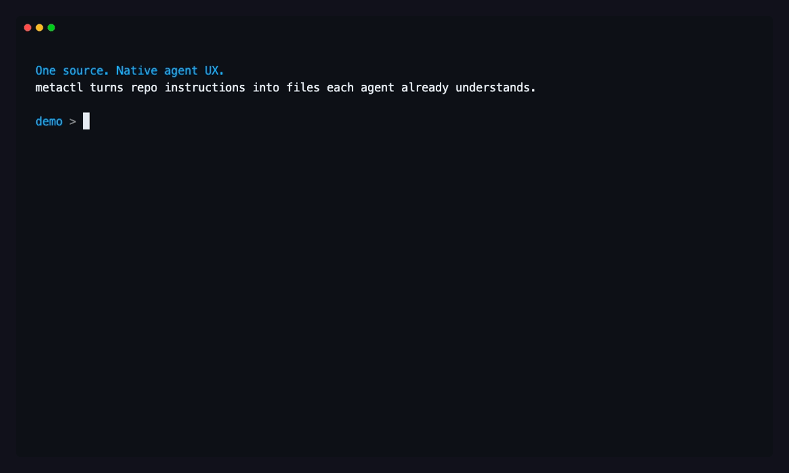
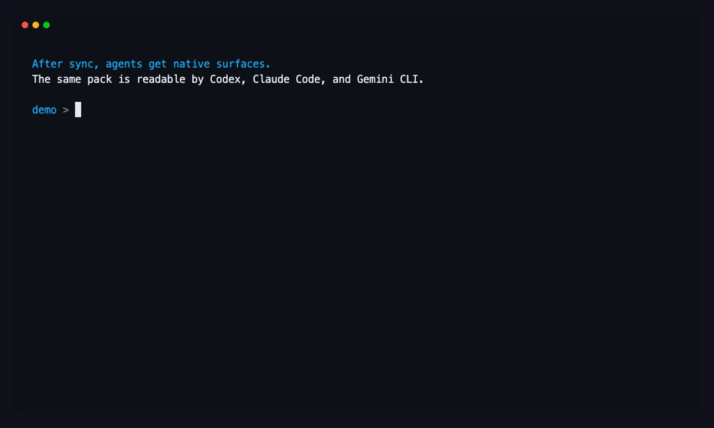
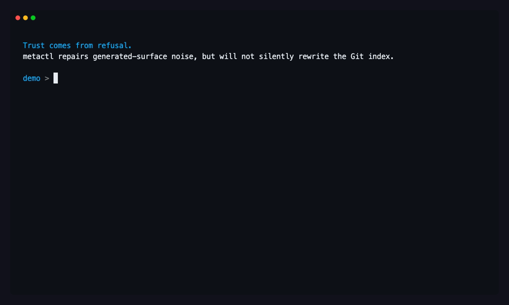

# CLI Demos

These demos show how `metactl` turns one repo-level source of truth into native agent files, skills, commands, hooks, and rules that developers can inspect before trusting.

## README hero

Use the quickstart hero when the viewer needs the product thesis in one loop: plan-first setup, one-command activation, and downstream native agent commands.

Also available as [MP4](assets/demos/quickstart-hero.mp4) and [WebM](assets/demos/quickstart-hero.webm).

## Asset catalog

| Asset | Best location | Shows |
|---|---|---|
| `quickstart-hero.gif` | README hero, launch posts | `setup --plan`, explicit setup, `use`, `status`, and generated agent commands |
| `agent-native-surfaces.gif` | Historical adapter demo | Shows a Codex command file retained for compatibility, plus Claude command and Gemini skill surfaces; current Codex invocation uses Agent Skills |
| `safe-repair.gif` | Safety and maintenance docs | Generated-root diagnostics, repair plan, explicit untracking guardrail |

## Native Agent Surfaces

After sync, developers do not have to mentally translate metactl concepts into each agent runtime. Current Codex project workflows are emitted as `.agents/skills` and invoked with `$skill-name`. The demo also shows a `.codex/commands` file retained for compatibility with existing installations; Codex does not register it as a project slash command. Do not remove this projection until a preservation-safe upgrade can retire existing symlinks.

Also available as [MP4](assets/demos/agent-native-surfaces.mp4) and [WebM](assets/demos/agent-native-surfaces.webm).

## Safety Repair

`metactl` keeps generated surfaces out of day-to-day Git noise, but it does not silently remove tracked files from the index. The repair flow shows the plan, refuses implicit untracking, and then applies only after the operator asks for that action.

Also available as [MP4](assets/demos/safe-repair.mp4) and [WebM](assets/demos/safe-repair.webm).
